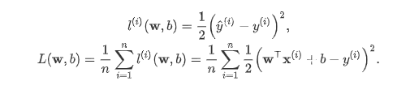
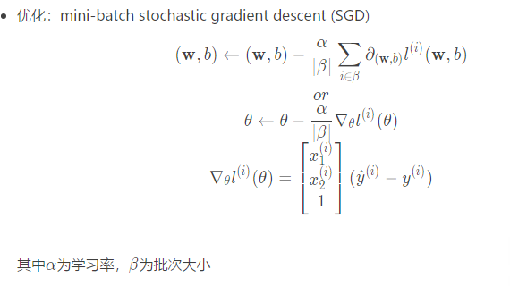
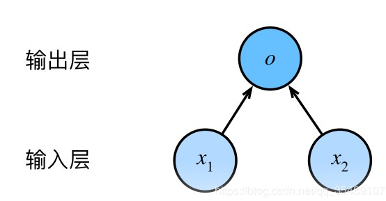
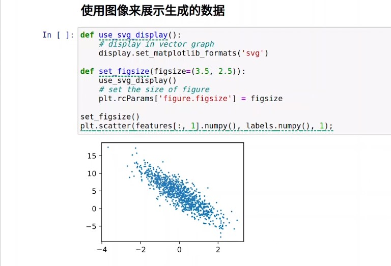
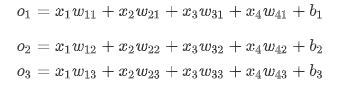
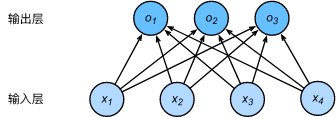
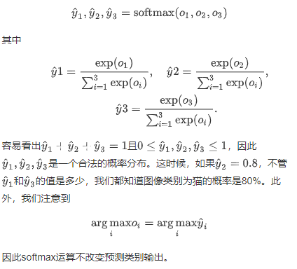
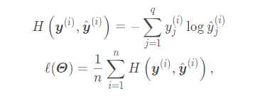
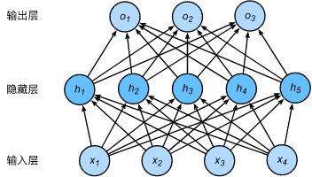

# Task 01 
# 1 线性回归
## 1.1模型


$$ 
\bold y=x_1w_1+x_2w_2+...+x_nw_n+b=\bold x \bold w+b
$$ 


## 1.2基本要素
### 数据集
- 数据集
- 样本Sample
- 标签label
- 特征（feature)：预测标签，表征样本的特点
### 损失函数：均方误差

### 优化函数-随机梯度下降

解析解（analytical solution）
数值解（numerical solution）
大多数深度学习模型并没有解析解，只能通过优化算法有限次迭代模型参数来尽可能降低损失函数的值。
#### 小批量随机梯度下降
在求解的优化算法中，小批量随机梯度下降（mini-batch stochastic gradient descent）在深度学习中被广泛使用。
##### 算法简介
先选取一组模型参数的初始值，如随机选取；接下来对参数进行多次迭代，使每次迭代都可能降低损失函数的值。在每次迭代中，先随机均匀采样一个由固定数目训练数据样本所组成的小批量（mini-batch），然后求小批量中数据样本的平均损失有关模型参数的导数（梯度），最后用此结果与预先设定的一个正数的乘积作为模型参数在本次迭代的减小量。
#### 小结
优化函数有两个步骤
- 初始化模型参数，一般来说使用随机初始化
- 在数据上迭代多次，通过在负梯度方向移动参数来更新每个参数
## 矢量计算
在模型训练或者预测时，处理多个数据样本并用到矢量计算。
### 矢量相加的两种方法
- 两个向量按元素逐一做标量加法
- 两个向量直接做矢量加法
我们应该尽可能采用矢量计算，以提升计算效率
## 1.3 表示方法


## 线性回归模型从零开始的实现
```
%matplotlib inline
```
使用 %matplotlib命令可以将matplotlib的图表直接嵌入到Notebook之中，或者使用指定的界面库显示图表，它有一个参数指定matplotlib图表的显示方式。inline表示将图表嵌入到Notebook中。
Python提供了许多魔法命令，使得在IPython环境中的操作更加得心应手。魔法命令都以%或者%%开头，以%开头的成为**行命令**，%%开头的称为**单元命令**。行命令只对命令所在的行有效，而单元命令则必须出现在单元的第一行，对整个单元的代码进行处理。
执行%magic可以查看关于各个命令的说明，而在命令之后添加?可以查看该命令的详细说明。
总结：%matplotlib inline 可以在Ipython编译器里直接使用，功能是可以内嵌绘图，并且可以省略掉plt.show()这一步。



***
# Softmax与分类模型
## Softmax回归的基本概念
softmax回归同线性回归一样，也是一个单层神经网络。线性回归用于连续值，softmax用于多输出离散值（分类任务）
- 分类问题
- 权重矢量

- 神经网络图
由于每个输出$$O_1,O_2,O_3$$的计算都要依赖于所有的输入$$x_1,x_2,x_3,x_4,softmax回归的输出层也是一个全连接层。

- 输出问题
直接使用输出层的输出有两个问题：
1. 由于输出层的输出值的范围不确定，我们难以直观上判断这些值的意义。
2. 由于真实标签是离散值，这些离散值与不确定范围的输出值之间的误差难以衡量。

softmax运算符（softmax operator）解决了以上两个问题。它通过下式将输出值变换成值为正且和为1的概率分布：

## 损失函数：交叉熵（cross entropy）


***

# 多层感知机
multilayer perceptron，MLP
## 隐藏层
下图展示了一个多层感知机的神经网络图，它含有一个隐藏层，该层中有5个隐藏单元。

## 表达公式
具体来说，给定一个小批量样本$\boldsymbol{X} \in \mathbb{R}^{n \times d}$，其批量大小为$n$，输入个数为$d$。假设多层感知机只有一个隐藏层，其中隐藏单元个数为$h$。记隐藏层的输出（也称为隐藏层变量或隐藏变量）为$\boldsymbol{H}$，有$\boldsymbol{H} \in \mathbb{R}^{n \times h}$。因为隐藏层和输出层均是全连接层，可以设隐藏层的权重参数和偏差参数分别为$\boldsymbol{W}_h \in \mathbb{R}^{d \times h}$和 $\boldsymbol{b}_h \in \mathbb{R}^{1 \times h}$，输出层的权重和偏差参数分别为$\boldsymbol{W}_o \in \mathbb{R}^{h \times q}$和$\boldsymbol{b}_o \in \mathbb{R}^{1 \times q}$。

含单隐藏层的多层感知机的设计。其输出$\boldsymbol{O} \in \mathbb{R}^{n \times q}$的计算为


$$
 \begin{aligned} \boldsymbol{H} &= \boldsymbol{X} \boldsymbol{W}_h + \boldsymbol{b}_h,\\ \boldsymbol{O} &= \boldsymbol{H} \boldsymbol{W}_o + \boldsymbol{b}_o, \end{aligned}
$$


也就是将隐藏层的输出直接作为输出层的输入。如果将以上两个式子联立起来，可以得到


$$
 \boldsymbol{O} = (\boldsymbol{X} \boldsymbol{W}_h + \boldsymbol{b}_h)\boldsymbol{W}_o + \boldsymbol{b}_o = \boldsymbol{X} \boldsymbol{W}_h\boldsymbol{W}_o + \boldsymbol{b}_h \boldsymbol{W}_o + \boldsymbol{b}_o. 
$$


虽然神经网络引入了隐藏层，却依然等价于一个单层神经网络：其中输出层权重参数为$\boldsymbol{W}_h\boldsymbol{W}_o$，偏差参数为$\boldsymbol{b}_h \boldsymbol{W}_o + \boldsymbol{b}_o$。不难发现，即便再添加更多的隐藏层，以上设计依然只能与仅含输出层的单层神经网络等价。
*因此需要激活函数*
### 激活函数
上述问题的根源在于全连接层只是对数据做仿射变换（affine transformation），而多个仿射变换的叠加仍然是一个仿射变换。解决问题的一个方法是引入非线性变换，例如对隐藏变量使用按元素运算的非线性函数进行变换，然后再作为下一个全连接层的输入。这个非线性函数被称为*激活函数（activation function）*。


