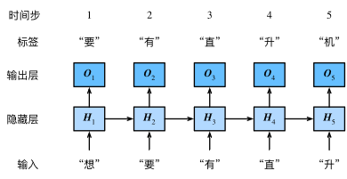

# 文本预处理

文本是一类序列数据，一篇文章可以看作是字符或单词的序列，
## 预处理通常包括四个步骤：

1. 读入文本
2. 分词
3. 建立字典，将每个词映射到一个唯一的索引（index）
4. 将文本从词的序列转换为索引的序列，方便输入模型

## 分词
···
def tokenize(sentences, token='word'):
    """Split sentences into word or char tokens"""
    if token == 'word':
        return [sentence.split(' ') for sentence in sentences]
    elif token == 'char':
        return [list(sentence) for sentence in sentences]
    else:
        print('ERROR: unkown token type '+token)

tokens = tokenize(lines)
tokens[0:2]
···
## 建立字典
构建一个字典
主要包含词条和索引
‘’‘
class Vocab(object):
    def __init__(self, tokens, min_freq=0, use_special_tokens=False):
        counter = count_corpus(tokens) # : 
        self.token_freqs = list(counter.items())
        self.idx_to_token = []
        if use_special_tokens:
            # padding, begin of sentence, end of sentence, unknown
            self.pad, self.bos, self.eos, self.unk = (0, 1, 2, 3)
            self.idx_to_token += ['', '', '', '']
        else:
            self.unk = 0
            self.idx_to_token += ['']
        self.idx_to_token += [token for token, freq in self.token_freqs
                        if freq >= min_freq and token not in self.idx_to_token]
        self.token_to_idx = dict()
        for idx, token in enumerate(self.idx_to_token):
            self.token_to_idx[token] = idx

    def __len__(self):
        return len(self.idx_to_token)

    def __getitem__(self, tokens):
        if not isinstance(tokens, (list, tuple)):
            return self.token_to_idx.get(tokens, self.unk)
        return [self.__getitem__(token) for token in tokens]

    def to_tokens(self, indices):
        if not isinstance(indices, (list, tuple)):
            return self.idx_to_token[indices]
        return [self.idx_to_token[index] for index in indices]

def count_corpus(sentences):
    tokens = [tk for st in sentences for tk in st]
    return collections.Counter(tokens) # 返回一个字典，记录每个词的出现次数

···

## 现有分词模型
- spaCy
- NLTK

# 语言模型
一段自然语言文本可以看作是一个离散时间序列，给定一个长度为$T$的词的序列$w_1, w_2, \ldots, w_T$，语言模型的目标就是评估该序列是否合理，即计算该序列的概率：

$$
P(w_1, w_2, \ldots, w_T).
$$

本节我们介绍基于统计的语言模型，主要是$n$元语法（$n$-gram）。在后续内容中，我们将会介绍基于神经网络的语言模型。

## n元语法
## 序列数据的采样
### 随机采样
下面的代码每次从数据里随机采样一个小批量。其中批量大小`batch_size`是每个小批量的样本数，`num_steps`是每个样本所包含的时间步数。
在随机采样中，每个样本是原始序列上任意截取的一段序列，相邻的两个随机小批量在原始序列上的位置不一定相毗邻。
### 相邻采样 
在相邻采样中，相邻的两个随机小批量在原始序列上的位置相毗邻。

# 循环神经网络（Recurrent Neural Network, RNN）
常用于序列数据的建模与预测

## 循环神经网络的构造

我们先看循环神经网络的具体构造。假设$\boldsymbol{X}_t \in \mathbb{R}^{n \times d}$是时间步$t$的小批量输入，$\boldsymbol{H}_t \in \mathbb{R}^{n \times h}$是该时间步的隐藏变量，则：

$$
\boldsymbol{H}_t = \phi(\boldsymbol{X}_t \boldsymbol{W}_{xh} + \boldsymbol{H}_{t-1} \boldsymbol{W}_{hh} + \boldsymbol{b}_h).
$$

其中，$\boldsymbol{W}_{xh} \in \mathbb{R}^{d \times h}$，$\boldsymbol{W}_{hh} \in \mathbb{R}^{h \times h}$，$\boldsymbol{b}_{h} \in \mathbb{R}^{1 \times h}$，$\phi$函数是非线性激活函数。由于引入了$\boldsymbol{H}_{t-1} \boldsymbol{W}_{hh}$，$H_{t}$能够捕捉截至当前时间步的序列的历史信息，就像是神经网络当前时间步的状态或记忆一样。由于$H_{t}$的计算基于$H_{t-1}$，上式的计算是循环的，使用循环计算的网络即循环神经网络（recurrent neural network）。

在时间步$t$，输出层的输出为：

$$
\boldsymbol{O}_t = \boldsymbol{H}_t \boldsymbol{W}_{hq} + \boldsymbol{b}_q.
$$

其中$\boldsymbol{W}_{hq} \in \mathbb{R}^{h \times q}$，$\boldsymbol{b}_q \in \mathbb{R}^{1 \times q}$。

### one-hot向量

我们需要将字符表示成向量，这里采用one-hot向量。假设词典大小是$N$，每次字符对应一个从$0$到$N-1$的唯一的索引，则该字符的向量是一个长度为$N$的向量，若字符的索引是$i$，则该向量的第$i$个位置为$1$，其他位置为$0$。下面分别展示了索引为0和2的one-hot向量，向量长度等于词典大小。