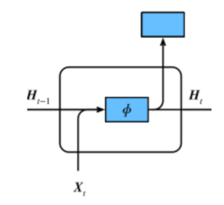

# 1 过拟合、欠拟合及其解决方案
1. 过拟合、欠拟合的概念
2. 权重衰减
3. 丢弃法
## 1.1 模型选择、过拟合和欠拟合
### 1.1.1 训练误差和泛化误差
- 训练误差（training error）
模型在*训练数据集*上表现出的误差
- 泛化误差（generalization error）
模型在*任意一个测试数据样本*上表现出的误差的**期望**，并常常通过测试数据集上的误差来近似。
计算训练误差和泛化误差可以使用之前介绍过的损失函数，例如线性回归用到的平方损失函数和softmax回归用到的交叉熵损失函数。
机器学习模型应关注**降低泛化误差**。
### 1.1.2 模型选择
#### 验证数据集
训练数据集和测试数据集之外的一部分数据
从严格意义上讲，测试集只能在所有超参数和模型参数选定后使用一次。不可以使用测试数据选择模型，如调参。由于无法从训练误差估计泛化误差，因此也不应只依赖训练数据选择模型。鉴于此，我们可以预留一部分在训练数据集和测试数据集以外的数据来进行模型选择。这部分数据被称为验证数据集，简称验证集（validation set）。例如，我们可以从给定的训练集中随机选取一小部分作为验证集，而将剩余部分作为真正的训练集。
#### K折交叉验证  
训练数据不足时，验证数据集不参与模型训练，预留过多的验证数据显得太过奢侈。
因此可以采用**K折交叉验证（K-fold cross-validation）**：把原始数据分隔为K个不重合的子数据集，然后做K次模型训练和验证。每一次，使用个一个子数据集验证模型，并使用其他K-1个子数据集来训练模型。在K次训练和验证过程中，每次用来验证模型的子数据集都不同。最后，我们对着K次训练误差和验证误差分别求平均。
### 1.1.3 过拟合和欠拟合
模型训练中经常出现的两类典型问题：
- 一类是模型无法得到较低的训练误差，我们将这一现象称作欠拟合（underfitting）；
- 另一类是模型的训练误差远小于它在测试数据集上的误差，我们称该现象为过拟合（overfitting）。
在实践中，我们要尽可能同时应对欠拟合和过拟合。虽然有很多因素可能导致这两种拟合问题，在这里我们重点讨论
两个因素：
- 模型复杂度
- 训练数据集大小。
#### 1.1.3.1 模型复杂度
为了解释模型复杂度，我们以多项式函数拟合为例。给定一个由标量数据特征$x$和对应的标量标签$y$组成的训练数据集，多项式函数拟合的目标是找一个$K$阶多项式函数


$$
 \hat{y} = b + \sum_{k=1}^K x^k w_k 
$$


来近似 $y$。在上式中，$w_k$是模型的权重参数，$b$是偏差参数。与线性回归相同，多项式函数拟合也使用平方损失函数。特别地，一阶多项式函数拟合又叫线性函数拟合。

给定训练数据集，模型复杂度和误差之间的关系：


#### 1.1.3.2 训练数据集大小
影响欠拟合和过拟合的另一个重要因素是训练数据集的大小。一般来说，如果训练数据集中样本数过少，特别是比模型参数数量（按元素计）更少时，过拟合更容易发生。此外，泛化误差不会随训练数据集里样本数量增加而增大。因此，在计算资源允许的范围之内，我们通常希望训练数据集大一些，特别是在模型复杂度较高时，例如层数较多的深度学习模型。

## 1.2 多项式函数拟合实验
```
%matplotlib inline
import torch
import numpy as np
import sys
sys.path.append("/home/kesci/input")
import d2lzh1981 as d2l
print(torch.__version__)
```
### 1.2.1 初始化模型参数
```
n_train, n_test, true_w, true_b = 100, 100, [1.2, -3.4, 5.6], 5
features = torch.randn((n_train + n_test, 1))
poly_features = torch.cat((features, torch.pow(features, 2), torch.pow(features, 3)), 1) 
labels = (true_w[0] * poly_features[:, 0] + true_w[1] * poly_features[:, 1]
          + true_w[2] * poly_features[:, 2] + true_b)
labels += torch.tensor(np.random.normal(0, 0.01, size=labels.size()), dtype=torch.float)
```
```
features[:2], poly_features[:2], labels[:2]
```
### 1.2.2 定义、训练和测试模型
```
def semilogy(x_vals, y_vals, x_label, y_label, x2_vals=None, y2_vals=None,
             legend=None, figsize=(3.5, 2.5)):
    # d2l.set_figsize(figsize)
    d2l.plt.xlabel(x_label)
    d2l.plt.ylabel(y_label)
    d2l.plt.semilogy(x_vals, y_vals)
    if x2_vals and y2_vals:
        d2l.plt.semilogy(x2_vals, y2_vals, linestyle=':')
        d2l.plt.legend(legend)
```
```
num_epochs, loss = 100, torch.nn.MSELoss()

def fit_and_plot(train_features, test_features, train_labels, test_labels):
    # 初始化网络模型
    net = torch.nn.Linear(train_features.shape[-1], 1)
    # 通过Linear文档可知，pytorch已经将参数初始化了，所以我们这里就不手动初始化了
    
    # 设置批量大小
    batch_size = min(10, train_labels.shape[0])    
    dataset = torch.utils.data.TensorDataset(train_features, train_labels) # 设置数据集
    train_iter = torch.utils.data.DataLoader(dataset, batch_size, shuffle=True) # 设置获取数据方式
    
    optimizer = torch.optim.SGD(net.parameters(), lr=0.01) # 设置优化函数，使用的是随机梯度下降优化
    train_ls, test_ls = [], []
    for _ in range(num_epochs):
        for X, y in train_iter: # 取一个批量的数据
            l = loss(net(X), y.view(-1, 1)) # 输入到网络中计算输出，并和标签比较求得损失函数
            optimizer.zero_grad() # 梯度清零，防止梯度累加干扰优化
            l.backward() # 求梯度
            optimizer.step() # 迭代优化函数，进行参数优化
        train_labels = train_labels.view(-1, 1)
        test_labels = test_labels.view(-1, 1)
        train_ls.append(loss(net(train_features), train_labels).item()) # 将训练损失保存到train_ls中
        test_ls.append(loss(net(test_features), test_labels).item()) # 将测试损失保存到test_ls中
    print('final epoch: train loss', train_ls[-1], 'test loss', test_ls[-1])    
    semilogy(range(1, num_epochs + 1), train_ls, 'epochs', 'loss',
             range(1, num_epochs + 1), test_ls, ['train', 'test'])
    print('weight:', net.weight.data,
          '\nbias:', net.bias.data)
```
### 1.2.3 三阶多项式函数拟合（正常）
```
fit_and_plot(poly_features[:n_train, :], poly_features[n_train:, :], labels[:n_train], labels[n_train:])
```
### 1.2.4 线性函数拟合（欠拟合）
```
fit_and_plot(features[:n_train, :], features[n_train:, :], labels[:n_train], labels[n_train:])
```
### 1.2.5 训练样本不足（过拟合）
```
fit_and_plot(poly_features[0:2, :], poly_features[n_train:, :], labels[0:2], labels[n_train:])
```

## 1.3 权重衰减
### 方法  
权重衰减等价于 $L_2$ 范数正则化（regularization）。正则化通过为模型损失函数添加惩罚项使学出的模型参数值较小，是应对过拟合的常用手段。

###  L2 范数正则化（regularization）
$L_2$范数正则化在模型原损失函数基础上添加$L_2$范数惩罚项，从而得到训练所需要最小化的函数。$L_2$范数惩罚项指的是模型权重参数每个元素的平方和与一个正的常数的乘积。以线性回归中的线性回归损失函数为例


$$
 \ell(w_1, w_2, b) = \frac{1}{n} \sum_{i=1}^n \frac{1}{2}\left(x_1^{(i)} w_1 + x_2^{(i)} w_2 + b - y^{(i)}\right)^2 
$$


其中$w_1, w_2$是权重参数，$b$是偏差参数，样本$i$的输入为$x_1^{(i)}, x_2^{(i)}$，标签为$y^{(i)}$，样本数为$n$。将权重参数用向量$\boldsymbol{w} = [w_1, w_2]$表示，带有$L_2$范数惩罚项的新损失函数为


$$
\ell(w_1, w_2, b) + \frac{\lambda}{2n} |\boldsymbol{w}|^2,
$$


其中超参数$\lambda > 0$。当权重参数均为0时，惩罚项最小。当$\lambda$较大时，惩罚项在损失函数中的比重较大，这通常会使学到的权重参数的元素较接近0。当$\lambda$设为0时，惩罚项完全不起作用。上式中$L_2$范数平方$|\boldsymbol{w}|^2$展开后得到$w_1^2 + w_2^2$。
有了$L_2$范数惩罚项后，在小批量随机梯度下降中，我们将线性回归一节中权重$w_1$和$w_2$的迭代方式更改为


$$
 \begin{aligned} w_1 &\leftarrow \left(1- \frac{\eta\lambda}{|\mathcal{B}|} \right)w_1 - \frac{\eta}{|\mathcal{B}|} \sum_{i \in \mathcal{B}}x_1^{(i)} \left(x_1^{(i)} w_1 + x_2^{(i)} w_2 + b - y^{(i)}\right),\\ w_2 &\leftarrow \left(1- \frac{\eta\lambda}{|\mathcal{B}|} \right)w_2 - \frac{\eta}{|\mathcal{B}|} \sum_{i \in \mathcal{B}}x_2^{(i)} \left(x_1^{(i)} w_1 + x_2^{(i)} w_2 + b - y^{(i)}\right). \end{aligned} 
$$


可见，$L_2$范数正则化令权重$w_1$和$w_2$先自乘小于1的数，再减去不含惩罚项的梯度。因此，$L_2$范数正则化又叫权重衰减。权重衰减通过惩罚绝对值较大的模型参数为需要学习的模型增加了限制，这可能对过拟合有效。

## 1.4 丢弃法
多层感知机中神经网络图描述了一个单隐藏层的多层感知机。其中输入个数为4，隐藏单元个数为5，且隐藏单元$h_i$（$i=1, \ldots, 5$）的计算表达式为


$$
 h_i = \phi\left(x_1 w_{1i} + x_2 w_{2i} + x_3 w_{3i} + x_4 w_{4i} + b_i\right) 
$$


这里$\phi$是激活函数，$x_1, \ldots, x_4$是输入，隐藏单元$i$的权重参数为$w_{1i}, \ldots, w_{4i}$，偏差参数为$b_i$。当对该隐藏层使用丢弃法时，该层的隐藏单元将有一定概率被丢弃掉。设丢弃概率为$p$，那么有$p$的概率$h_i$会被清零，有$1-p$的概率$h_i$会除以$1-p$做拉伸。丢弃概率是丢弃法的超参数。具体来说，设随机变量$\xi_i$为0和1的概率分别为$p$和$1-p$。使用丢弃法时我们计算新的隐藏单元$h_i'$


$$
 h_i' = \frac{\xi_i}{1-p} h_i 
$$


由于$E(\xi_i) = 1-p$，因此


$$
 E(h_i') = \frac{E(\xi_i)}{1-p}h_i = h_i 
$$


即丢弃法不改变其输入的期望值。让我们对之前多层感知机的神经网络中的隐藏层使用丢弃法，一种可能的结果如图所示，其中$h_2$和$h_5$被清零。这时输出值的计算不再依赖$h_2$和$h_5$，在反向传播时，与这两个隐藏单元相关的权重的梯度均为0。由于在训练中隐藏层神经元的丢弃是随机的，即$h_1, \ldots, h_5$都有可能被清零，输出层的计算无法过度依赖$h_1, \ldots, h_5$中的任一个，从而在训练模型时起到正则化的作用，并可以用来应对过拟合。在测试模型时，我们为了拿到更加确定性的结果，一般不使用丢弃法


## 1.5 总结

- 欠拟合现象：模型无法达到一个较低的误差
    
- 过拟合现象：训练误差较低但是泛化误差依然较高，二者相差较大

***
# 2 梯度消失、梯度爆炸
## 2.1 梯度消失和梯度爆炸

深度模型有关数值稳定性的典型问题是消失（vanishing）和爆炸（explosion）。

**当神经网络的层数较多时，模型的数值稳定性容易变差。**

假设一个层数为$L$的多层感知机的第$l$层$\boldsymbol{H}^{(l)}$的权重参数为$\boldsymbol{W}^{(l)}$，输出层$\boldsymbol{H}^{(L)}$的权重参数为$\boldsymbol{W}^{(L)}$。为了便于讨论，不考虑偏差参数，且设所有隐藏层的激活函数为恒等映射（identity mapping）$\phi(x) = x$。给定输入$\boldsymbol{X}$，多层感知机的第$l$层的输出$\boldsymbol{H}^{(l)} = \boldsymbol{X} \boldsymbol{W}^{(1)} \boldsymbol{W}^{(2)} \ldots \boldsymbol{W}^{(l)}$。此时，如果层数$l$较大，$\boldsymbol{H}^{(l)}$的计算可能会出现衰减或爆炸。举个例子，假设输入和所有层的权重参数都是标量，如权重参数为0.2和5，多层感知机的第30层输出为输入$\boldsymbol{X}$分别与$0.2^{30} \approx 1 \times 10^{-21}$（消失）和$5^{30} \approx 9 \times 10^{20}$（爆炸）的乘积。当层数较多时，梯度的计算也容易出现消失或爆炸。

## 2.2 随机初始化模型参数

在神经网络中，通常需要随机初始化模型参数。下面我们来解释这样做的原因。

回顾多层感知机一节描述的多层感知机。为了方便解释，假设输出层只保留一个输出单元$o_1$（删去$o_2$和$o_3$以及指向它们的箭头），且隐藏层使用相同的激活函数。如果将每个隐藏单元的参数都初始化为相等的值，那么在正向传播时每个隐藏单元将根据相同的输入计算出相同的值，并传递至输出层。在反向传播中，每个隐藏单元的参数梯度值相等。因此，这些参数在使用基于梯度的优化算法迭代后值依然相等。之后的迭代也是如此。在这种情况下，无论隐藏单元有多少，隐藏层本质上只有1个隐藏单元在发挥作用。因此，正如在前面的实验中所做的那样，我们通常将神经网络的模型参数，特别是权重参数，进行随机初始化。


### PyTorch的默认随机初始化

随机初始化模型参数的方法有很多。在线性回归的简洁实现中，我们使用`torch.nn.init.normal_()`使模型`net`的权重参数采用正态分布的随机初始化方式。不过，PyTorch中`nn.Module`的模块参数都采取了较为合理的初始化策略（不同类型的layer具体采样的哪一种初始化方法的可参考[源代码](https://github.com/pytorch/pytorch/tree/master/torch/nn/modules)），因此一般不用我们考虑。


### Xavier随机初始化

还有一种比较常用的随机初始化方法叫作Xavier随机初始化。
假设某全连接层的输入个数为$a$，输出个数为$b$，Xavier随机初始化将使该层中权重参数的每个元素都随机采样于均匀分布


$$
U\left(-\sqrt{\frac{6}{a+b}}, \sqrt{\frac{6}{a+b}}\right).
$$


它的设计主要考虑到，模型参数初始化后，每层输出的方差不该受该层输入个数影响，且每层梯度的方差也不该受该层输出个数影响。
# 考虑环境因素

## 协变量偏移

这里我们假设，虽然输入的分布可能随时间而改变，但是标记函数，即条件分布P（y∣x）不会改变。虽然这个问题容易理解，但在实践中也容易忽视。

想想区分猫和狗的一个例子。我们的训练数据使用的是猫和狗的真实的照片，但是在测试时，我们被要求对猫和狗的卡通图片进行分类。

|cat|cat|dog|dog|
|:---------------:|:---------------:|:---------------:|:---------------:|
|||||

测试数据：

|cat|cat|dog|dog|
|:---------------:|:---------------:|:---------------:|:---------------:|
||||
|

显然，这不太可能奏效。训练集由照片组成，而测试集只包含卡通。在一个看起来与测试集有着本质不同的数据集上进行训练，而不考虑如何适应新的情况，这是不是一个好主意。不幸的是，这是一个非常常见的陷阱。

统计学家称这种协变量变化是因为问题的根源在于特征分布的变化（即协变量的变化）。数学上，我们可以说P（x）改变了，但P（y∣x）保持不变。尽管它的有用性并不局限于此，当我们认为x导致y时，协变量移位通常是正确的假设。


## 标签偏移

    
当我们认为导致偏移的是标签P（y）上的边缘分布的变化，但类条件分布是不变的P（x∣y）时，就会出现相反的问题。当我们认为y导致x时，标签偏移是一个合理的假设。例如，通常我们希望根据其表现来预测诊断结果。在这种情况下，我们认为诊断引起的表现，即疾病引起的症状。有时标签偏移和协变量移位假设可以同时成立。例如，当真正的标签函数是确定的和不变的，那么协变量偏移将始终保持，包括如果标签偏移也保持。有趣的是，当我们期望标签偏移和协变量偏移保持时，使用来自标签偏移假设的方法通常是有利的。这是因为这些方法倾向于操作看起来像标签的对象，这（在深度学习中）与处理看起来像输入的对象（在深度学习中）相比相对容易一些。

病因（要预测的诊断结果）导致 症状（观察到的结果）。  

训练数据集，数据很少只包含流感p(y)的样本。  

而测试数据集有流感p(y)和流感q(y)，其中不变的是流感症状p(x|y)。


## 概念偏移

另一个相关的问题出现在概念转换中，即标签本身的定义发生变化的情况。这听起来很奇怪，毕竟猫就是猫。的确，猫的定义可能不会改变，但我们能不能对软饮料也这么说呢？事实证明，如果我们周游美国，按地理位置转移数据来源，我们会发现，即使是如图所示的这个简单术语的定义也会发生相当大的概念转变。


$$
美国软饮料名称的概念转变 
$$
如果我们要建立一个机器翻译系统，分布P（y∣x）可能因我们的位置而异。这个问题很难发现。另一个可取之处是P（y∣x）通常只是逐渐变化。

# 3 循环神经网络进阶
# GRU

RNN存在的问题：梯度较容易出现衰减或爆炸（BPTT）  
⻔控循环神经⽹络：捕捉时间序列中时间步距离较⼤的依赖关系  
**RNN**:  





$$
H_{t} = ϕ(X_{t}W_{xh} + H_{t-1}W_{hh} + b_{h})
$$
**GRU**:


$$
R_{t} = σ(X_tW_{xr} + H_{t−1}W_{hr} + b_r)\\    
Z_{t} = σ(X_tW_{xz} + H_{t−1}W_{hz} + b_z)\\  
\widetilde{H}_t = tanh(X_tW_{xh} + (R_t ⊙H_{t−1})W_{hh} + b_h)\\
H_t = Z_t⊙H_{t−1} + (1−Z_t)⊙\widetilde{H}_t
$$
• 重置⻔有助于捕捉时间序列⾥短期的依赖关系；  
• 更新⻔有助于捕捉时间序列⾥⻓期的依赖关系。    

# LSTM
** 长短期记忆long short-term memory **:  
遗忘门:控制上一时间步的记忆细胞 
输入门:控制当前时间步的输入  
输出门:控制从记忆细胞到隐藏状态  
记忆细胞：⼀种特殊的隐藏状态的信息的流动  


$$
I_t = σ(X_tW_{xi} + H_{t−1}W_{hi} + b_i) \\
F_t = σ(X_tW_{xf} + H_{t−1}W_{hf} + b_f)\\
O_t = σ(X_tW_{xo} + H_{t−1}W_{ho} + b_o)\\
\widetilde{C}_t = tanh(X_tW_{xc} + H_{t−1}W_{hc} + b_c)\\
C_t = F_t ⊙C_{t−1} + I_t ⊙\widetilde{C}_t\\
H_t = O_t⊙tanh(C_t)
$$

# 深度循环神经网络


$$
\boldsymbol{H}_t^{(1)} = \phi(\boldsymbol{X}_t \boldsymbol{W}_{xh}^{(1)} + \boldsymbol{H}_{t-1}^{(1)} \boldsymbol{W}_{hh}^{(1)} + \boldsymbol{b}_h^{(1)})\\
\boldsymbol{H}_t^{(\ell)} = \phi(\boldsymbol{H}_t^{(\ell-1)} \boldsymbol{W}_{xh}^{(\ell)} + \boldsymbol{H}_{t-1}^{(\ell)} \boldsymbol{W}_{hh}^{(\ell)} + \boldsymbol{b}_h^{(\ell)})\\
\boldsymbol{O}_t = \boldsymbol{H}_t^{(L)} \boldsymbol{W}_{hq} + \boldsymbol{b}_q
$$

# 双向循环神经网络 


$$ 
\begin{aligned} \overrightarrow{\boldsymbol{H}}_t &= \phi(\boldsymbol{X}_t \boldsymbol{W}_{xh}^{(f)} + \overrightarrow{\boldsymbol{H}}_{t-1} \boldsymbol{W}_{hh}^{(f)} + \boldsymbol{b}_h^{(f)})\\
\overleftarrow{\boldsymbol{H}}_t &= \phi(\boldsymbol{X}_t \boldsymbol{W}_{xh}^{(b)} + \overleftarrow{\boldsymbol{H}}_{t+1} \boldsymbol{W}_{hh}^{(b)} + \boldsymbol{b}_h^{(b)}) \end{aligned} $$
$$
\boldsymbol{H}_t=(\overrightarrow{\boldsymbol{H}}_{t}, \overleftarrow{\boldsymbol{H}}_t)
$$
$$
\boldsymbol{O}_t = \boldsymbol{H}_t \boldsymbol{W}_{hq} + \boldsymbol{b}_q
$$