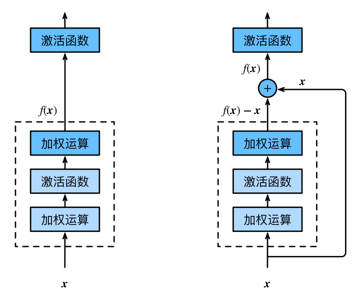
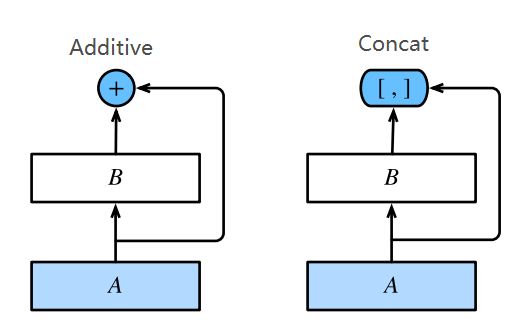
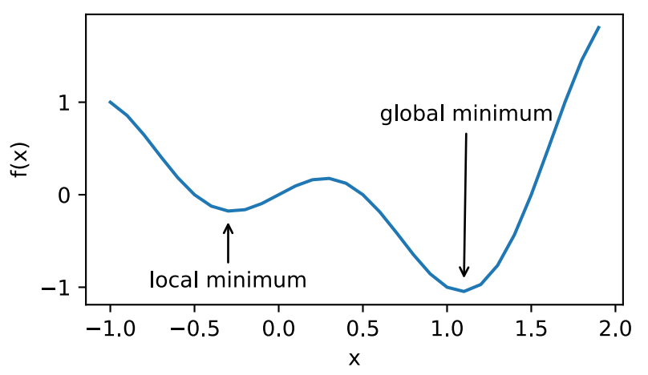
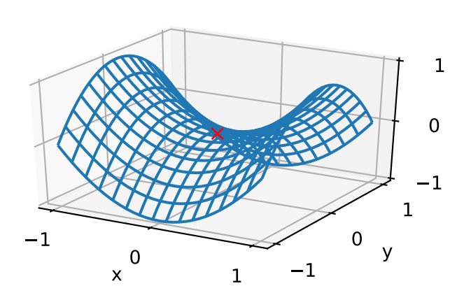

# Task 06- BN-ResNet-凸优化-梯度下降

## 1 批量归一化

### 1.0 标准化

* 将原始数据全体样本某个特征的处理为均值为0、标准差为1的分布 --> 使得输入数据各个特征的分布相近（能更有效训练模型）

$$
\hat{\bold y}=\frac{\bold{y}-\mu_y}{\sigma_y}
$$

### 1.1 批量归一化（Batch Normalization）

* 利用小批量上的均值和标准差，不断调整神经网络中间输出，从而使整个神经网络在各层的中间输出的数值更稳定
* 位置：激活函数之前

#### 1.1.1 全连接层BN

$$
\boldsymbol{\mu}_\mathcal{B} \leftarrow \frac{1}{m}\sum_{i = 1}^{m} \boldsymbol{x}^{(i)},\boldsymbol{\sigma}_\mathcal{B}^2 \leftarrow \frac{1}{m} \sum_{i=1}^{m}(\boldsymbol{x}^{(i)} - \boldsymbol{\mu}_\mathcal{B})^2
\\
\hat{\boldsymbol{x}}^{(i)} \leftarrow \frac{\boldsymbol{x}^{(i)} - \boldsymbol{\mu}_\mathcal{B}}{\sqrt{\boldsymbol{\sigma}_\mathcal{B}^2 + \epsilon}}
\\
{\boldsymbol{y}}^{(i)} \leftarrow \boldsymbol{\gamma} \odot
\hat{\boldsymbol{x}}^{(i)} + \boldsymbol{\beta}.
$$

* 其中，$\epsilon>0\ $为很小的常数，保证分母有效；$\boldsymbol{\gamma},\boldsymbol{\beta}\ $为拉伸参数与偏移参数（可学习）

#### 1.1.2 卷积层BN

* 如果卷积计算输出多个通道，我们需要<u>对这些通道的输出分别做批量归一化</u>，且<u>每个通道都拥有独立的拉伸和偏移参数</u>；
* 对单通道，$batchsize=m$，卷积计算输出$\ =pxq$ ，对该通道中$(m×p×q)$个元素同时做批量归一化，使用相同的均值和方差。

#### 1.1.3 预测阶段BN

* 训练：以batch为单位,对每个batch计算均值和方差
* 预测：用移动平均估算整个训练数据集的样本均值和方差

### 1.2 代码

```python
def batch_norm(is_training, X, gamma, beta, moving_mean, moving_var, eps, momentum):
    # 判断当前模式是训练模式还是预测模式
    if not is_training:
        # 如果是在预测模式下，直接使用传入的移动平均所得的均值和方差
        X_hat = (X - moving_mean) / torch.sqrt(moving_var + eps)
    else:
        assert len(X.shape) in (2, 4)
        if len(X.shape) == 2:
            # 使用全连接层的情况，计算特征维上的均值和方差
            mean = X.mean(dim=0)
            var = ((X - mean) ** 2).mean(dim=0)
        else:
            # 使用二维卷积层的情况，计算通道维上（axis=1）的均值和方差。这里我们需要保持
            # X的形状以便后面可以做广播运算
            mean = X.mean(dim=0, keepdim=True).mean(dim=2, keepdim=True).mean(dim=3, keepdim=True)
            var = ((X - mean) ** 2).mean(dim=0, keepdim=True).mean(dim=2, keepdim=True).mean(dim=3, keepdim=True)
        # 训练模式下用当前的均值和方差做标准化
        X_hat = (X - mean) / torch.sqrt(var + eps)
        # 更新移动平均的均值和方差
        moving_mean = momentum * moving_mean + (1.0 - momentum) * mean
        moving_var = momentum * moving_var + (1.0 - momentum) * var
    Y = gamma * X_hat + beta # 拉伸和偏移
    return Y, moving_mean, moving_var


class BatchNorm(nn.Module):
    def __init__(self, num_features, num_dims):
        super(BatchNorm, self).__init__()
        if num_dims == 2:
            shape = (1, num_features) #全连接层输出神经元
        else:
            shape = (1, num_features, 1, 1) #通道数
        # 参与求梯度和迭代的拉伸和偏移参数，分别初始化成0和1
        self.gamma = nn.Parameter(torch.ones(shape))
        self.beta = nn.Parameter(torch.zeros(shape))
        # 不参与求梯度和迭代的变量，全在内存上初始化成0
        self.moving_mean = torch.zeros(shape)
        self.moving_var = torch.zeros(shape)

    def forward(self, X):
        # 如果X不在内存上，将moving_mean和moving_var复制到X所在显存上
        if self.moving_mean.device != X.device:
            self.moving_mean = self.moving_mean.to(X.device)
            self.moving_var = self.moving_var.to(X.device)
        # 保存更新过的moving_mean和moving_var, Module实例的traning属性默认为true, 调用.eval()后设成false
        Y, self.moving_mean, self.moving_var = batch_norm(self.training, 
            X, self.gamma, self.beta, self.moving_mean,
            self.moving_var, eps=1e-5, momentum=0.9)
        return Y
```


## 2 Residual Connection

### 2.0 Inspiration

* 对一个已经训练好的深度神经网络添加新的层，理论上，只要将新的层训练成恒等映射$f(x;W)=x$，新模型将会和原模型同样有效；
* 实践中，添加过多的层后训练误差往往不降反升（BN不能消除该问题）
* Kaiming He (2014) 将该问题称为$\ network\ degradation\ $并通过残差连接解决了该问题

### 2.1 ResNet




* 在普通仿射计算中，$f(x)\ $要学习成恒等变换需要保证块内仿射计算之后接近1
* 在残差块中，$f(x)\ $要学习成恒等变换可直接把权重置0，而通过残差连接实现

### 2.2 DenseNet




## 3 凸优化

### 3.0 深度学习中的最优化

* 深度学习目标：最小化泛化误差（测试集上误差）
* 最优化目标：最小化损失函数（训练误差）

### 3.1 挑战

* 局部极小值



* 鞍点：
  * 当函数的海森矩阵在梯度为零的位置上的特征值全为正时，该函数得到局部最小值；
  * 当函数的海森矩阵在梯度为零的位置上的特征值全为负时，该函数得到局部最大值；
  * 当函数的海森矩阵在梯度为零的位置上的特征值有正有负时，该函数得到鞍点




### 3.3 凸性（convexity）

* 函数：

$$
\lambda f(x)+(1-\lambda) f\left(x^{\prime}\right) \geq f\left(\lambda x+(1-\lambda) x^{\prime}\right)
$$

* Jensen不等式

$$
E_x[f(x)]\ge f(E_x[x])
\\
\sum_{i} \alpha_{i} f\left(x_{i}\right) \geq f\left(\sum_{i} \alpha_{i} x_{i}\right)
$$

### 3.4 凸函数性质

1. 无局部极小值

   若存在 $x\in X$ 为局部最小值，则存在全局最小值 $x^{\prime} \in X$，使 $f(x)>f(x^{\prime})$，则对$\lambda \in (0,1]:$
   $$
   f(x)>\lambda f(x)+(1-\lambda)f(x^{\prime}) \ge f(\lambda x+(1-\lambda)x^{\prime})
   \\
   \text{即任意位于}x与x'\text{之间点的函数值都小于等于}x\text{处的函数值，与局部最小值的定义不符}
   \\
   \exists \epsilon,f(x)<f(x+\epsilon)
   $$

2. 与凸集的关系

   对凸函数$f(x)$，定义集合$S_{b}:=\{x | x \in X \text { and } f(x) \leq b\}$，则 $S_b$ 为凸集合

3. $f^{''}(x) \ge 0 \Longleftrightarrow f(x)$为凸函数


## 4 梯度下降

### 4.1 一维梯度下降

证：沿梯度反方向移动自变量可以减小函数值

泰勒展开：
$$
f(x+\epsilon)=f(x)+\epsilon f^{\prime}(x)+\mathcal{O}\left(\epsilon^{2}\right)
$$
代入沿梯度方向的移动量 $\eta f^{\prime}(x)$：
$$
f\left(x-\eta f^{\prime}(x)\right)=f(x)-\eta f^{\prime 2}(x)+\mathcal{O}\left(\eta^{2} f^{\prime 2}(x)\right)
\\
\Longrightarrow f\left(x-\eta f^{\prime}(x)\right) < f(x)
$$

### 4.2 多维梯度下降

$$
\nabla f(\mathbf{x})=\left[\frac{\partial f(\mathbf{x})}{\partial x_{1}}, \frac{\partial f(\mathbf{x})}{\partial x_{2}}, \dots, \frac{\partial f(\mathbf{x})}{\partial x_{d}}\right]^{\top}
\\
\mathbf{x} \leftarrow \mathbf{x}-\eta \nabla f(\mathbf{x})
$$

